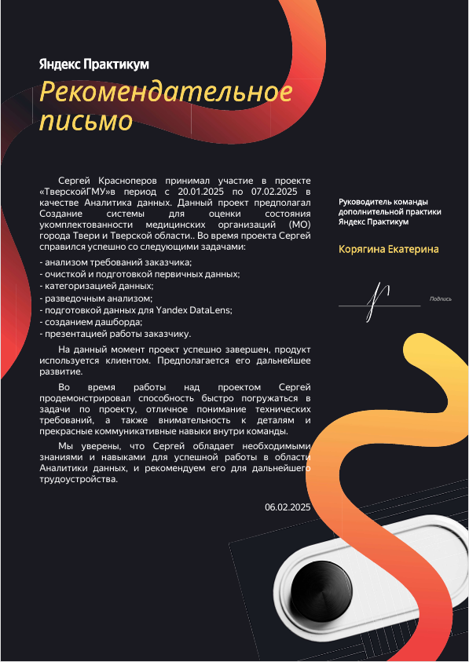

## 2. :stethoscope::pill: Тверской ГМУ - первичный анализ и оценкамедицинских организаций Твери и Тверской области
## ссылка на дашборд: :arrow_right:  <a href="https://datalens.yandex/70rkmvq60cu6t">Тверской ГМУ</a>

  

### Цель исследования: Анализ кадровой ситуации в первичном звене здравоохранения Тверской области с акцентом на распределение медицинских работников по возрасту, полу, географическому расположению (г. Тверь и районы области), а также тенденции трудоустройства выпускников медицинского университета.
### На основе полученных данных построен дашборд с картами районов, который позволяет наглядно увидеть результаты исследования. Он показывает:
- кадровый голод в сравнении г.Твери и районов Тверской области;
- распределение возрастных категорий по регионам;
- плотность выпускников Тверского ГМУ.
### В ходе исследования были использованы следующие метрики:
- количество сотрудников;
- количество организаций;
- медианный возраст сотрудников.
### С помощью данного дашборда возможно:
- оценить распределение врачей по округам и районам;
- исследовать возрастные категории врачей по трём возрастным категориям;
- сделать выводы о распределении выпускников Тверского ГМУ по г.Твери и районам Тверской области.

